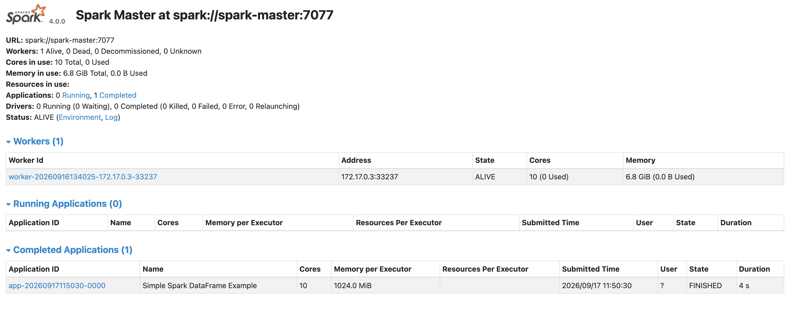
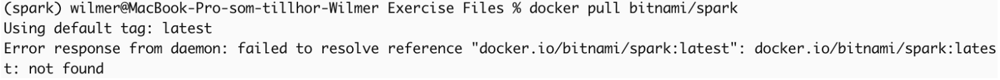
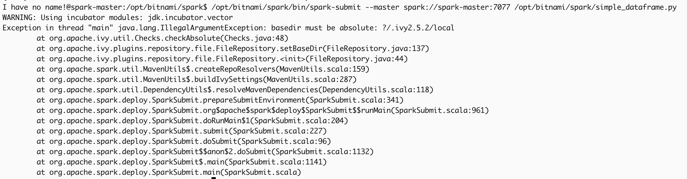

# Big Data: Lab 1

## General
I used an Apache Spark Docker image to perform the work.
MacOS was used.

## Main steps
I pulled the Spark image from Docker Hub.
I created and ran the Spark Master container.
I created and ran one Spark Worker container.
I linked the worker to the master.
I verified the cluster and the session run using the Spark Web UI.



## Encountered errors

### First error
**The cause:** bitnami’s spark image is no longer being updated and have therefore been moved to bitnamilegacy/spark on docker hub.



**The solution:** Change the name from bitnami/spark to bitnamilegacy/spark in the command: ```docker pull bitnamilegacy/spark.```

Also adding "legacy" in the following commands.
```
docker run -d --name spark-master -h spark-master -p 8080:8080 bitnamilegacy/spark
```

```
docker run -d --name spark-worker -h spark-worker --link spark-master:spark-master bitnamilegacy/spark /opt/bitnami/spark/bin/spark-class org.apache.spark.deploy.worker.Worker spark://spark-master:7077
```

### Second error
While attempting to run the spark-submit command: 
```
/opt/bitnami/spark/bin/spark-submit --master spark://spark-master:7077 /opt/bitnami/spark/simple_dataframe.py
``` 

I got the following error: 



***solution:*** Add the flag --conf to give an actual address for the .ivy directory: 
```
/opt/bitnami/spark/bin/spark-submit \
  --master spark://spark-master:7077 \
  --conf spark.jars.ivy=/tmp/.ivy2 \
  /opt/bitnami/spark/simple_dataframe.py
```

### Third error
Running the updated command gave me a new error:

```
WARNING: Using incubator modules: jdk.incubator.vector
  File "/opt/bitnami/spark/simple_dataframe.py", line 6
    .appName("Simple Spark DataFrame Example")
IndentationError: unexpected indent
26/09/17 11:41:18 INFO ShutdownHookManager: Shutdown hook called
26/09/17 11:41:18 INFO ShutdownHookManager: Deleting directory /tmp/spark-6160c04f-bc29-4a15-986c-0bd0c7f9cd46
```
This was solved by adjusting line 6 in the simple_dataframe.py file to have the three consecutive functions to be on the same line:
``` (python)
spark = SparkSession.builder.appName("Simple Spark DataFrame Example").getOrCreate()
```


