# Lab 2

Started the master and the worker through Docker's GUI.

```
docker cp /path/to/task_1.py spark-master:/opt/bitnami/spark/
```
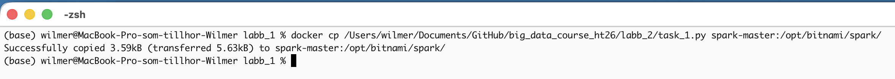

```
docker exec -it spark-master /bin/bash
```
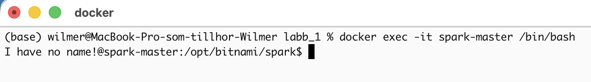

```
/opt/bitnami/spark/bin/spark-submit \
  --master spark://spark-master:7077 \
  --conf spark.jars.ivy=/tmp/.ivy2 \
  /opt/bitnami/spark/task_1.py
```
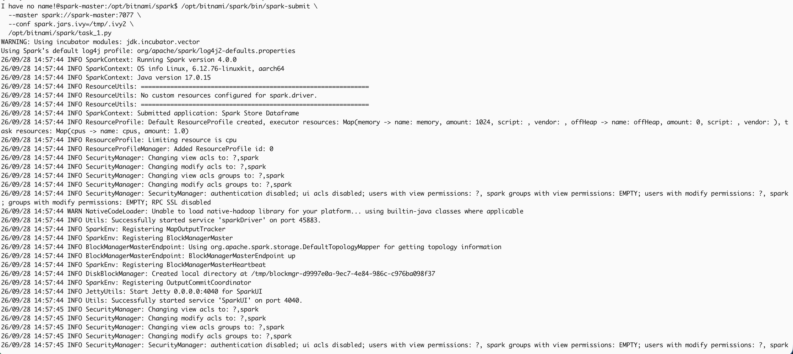


First python code executed showing the created dataframe and the column names with their datatypes.


Only product and price columns. 
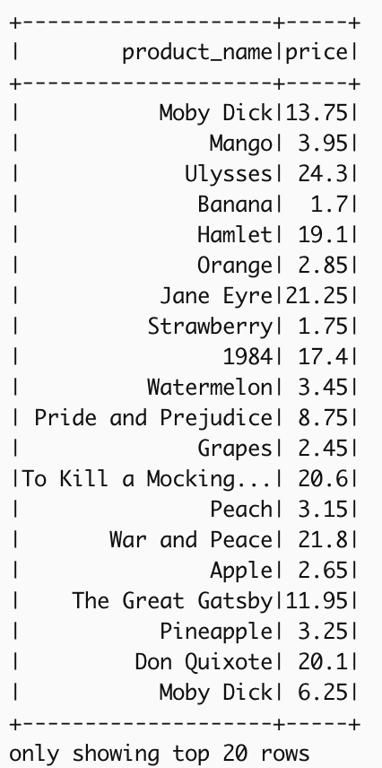

```
items_df.filter("price > 2").show()
```


count in each category.
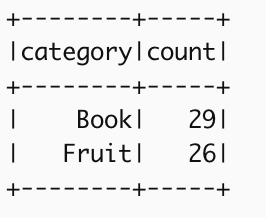

Average price.
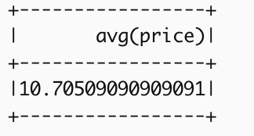

Sales price.
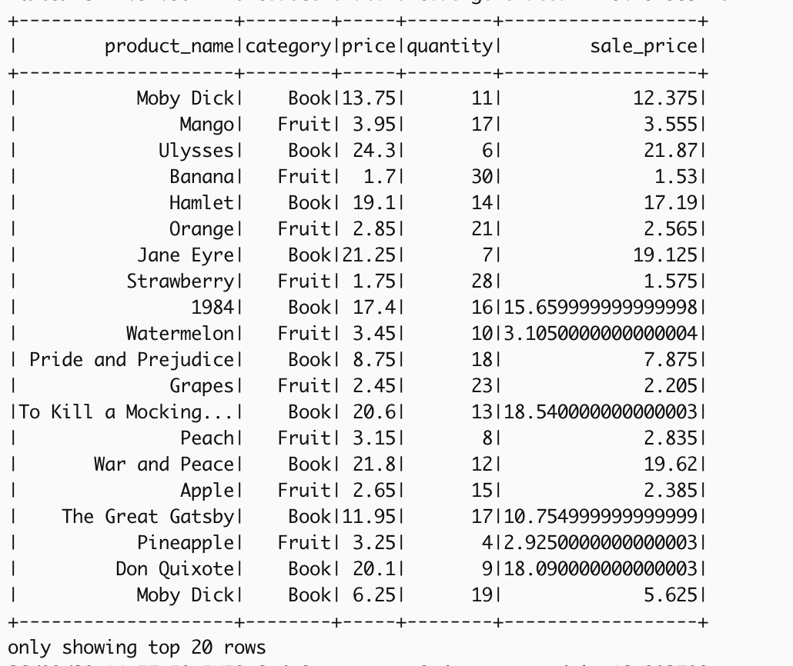

Create a temp view.
```
items_df.createOrReplaceTempView("retail_sales")
```
Number of sales per product.
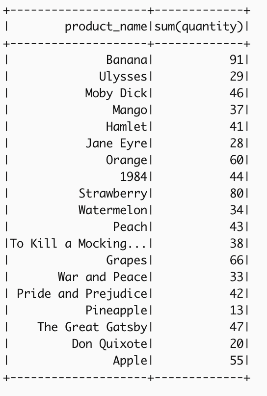

Sum of sales for each category.
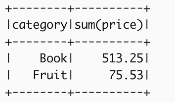


When creating a pandas UDF, I needed to install pandas and pyarrow. (Both in the master and the worker).
```
pip install pandas pyarrow
```
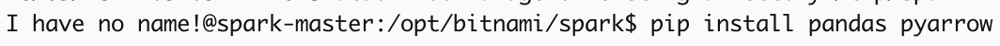

Copy over the python script for task 2.
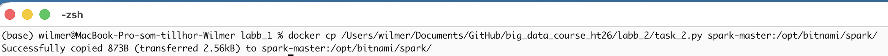

Submit the script.
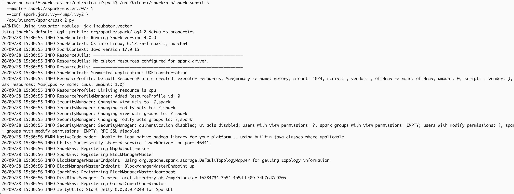

Utilizing the custom Spark UDF that multiplies the numbers in the dataframe by 3.
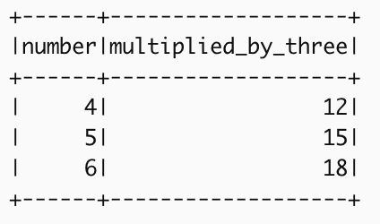

Now the Pandas UDF that subtracts two.
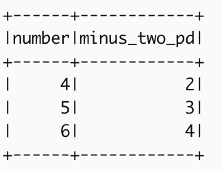


### Error
There was a '*' sign in the dataset string in the PDF that made the attempt to submit the python script throw an error.


Tip to self: crtl + P followed by ctrl + Q to stop a docker session/execution in terminal. (undo docker exec ...)


